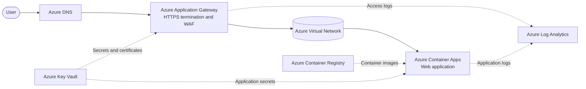

# frontierfriday

## Azure-hosted web application

This application is a containerized web application hosted on **Azure Container
Apps**. Users reach the application through an **Azure Application Gateway**,
which provides a single public entry point, TLS termination, health probes, and
optional Web Application Firewall (WAF) protection. The gateway is deployed in
an **Azure Virtual Network (VNet)** and routes approved requests to the
Container Apps environment over private network connectivity.

The architecture uses the following Azure services:

- **Azure Application Gateway**: Receives internet traffic, terminates HTTPS,
  performs health checks, and load-balances requests to the application.
- **Azure Virtual Network**: Provides network isolation and subnets for the
  gateway and private application connectivity.
- **Azure Container Apps**: Runs the web application containers with managed
  ingress, revisions, autoscaling, and rolling deployments.
- **Azure Container Registry**: Stores versioned container images that are
  pulled by Container Apps during deployment.
- **Azure Log Analytics**: Collects container and platform logs for
  monitoring and troubleshooting.
- **Azure Key Vault**: Stores secrets such as certificates, connection strings,
  and other sensitive configuration values.

### Architecture diagram

This design separates the public edge from the application runtime: the
Application Gateway handles inbound traffic and protection, while the VNet
keeps communication with Container Apps private. Container Registry provides a
repeatable deployment source, Key Vault avoids embedding secrets in images or
configuration, and Log Analytics provides a central place to diagnose the
system.

Kaiszer Soze (more commonly spelled **Keyser Söze**) is the mysterious
criminal mastermind in *The Usual Suspects*. He is presented through the
survivors’ account as an almost mythical figure who manipulates events from
the shadows; the film’s ending reveals that the story was largely fabricated
by Verbal Kint, leaving the audience questioning whether Söze exists as
described at all.
